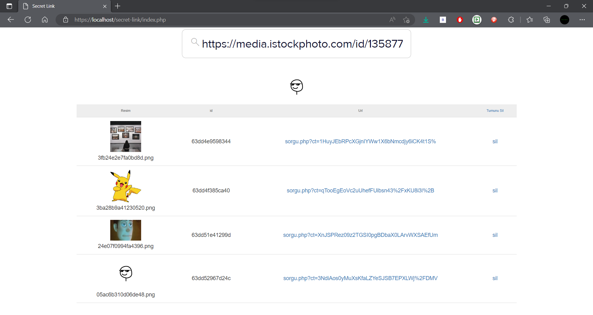
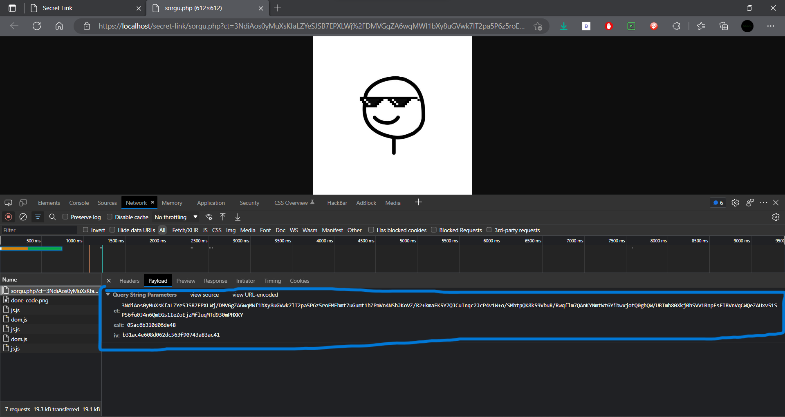
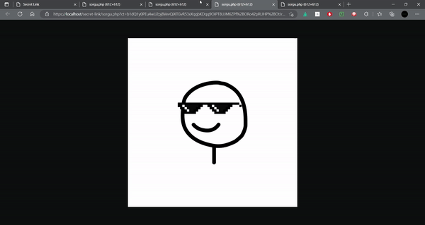

## Secret-Link

<h1 align = 'center'> Ana Sayfa | Link Oluşturma </h1>
<p>
 Bu projeyi kullanarak herhangi bağlantıyı AES ( AES-256-CBC ) yöntemi ile şifreleyip, o bağlantıya birden fazla şifreli link ile erişebilirsiniz.
</p>

<hr />


<p>
 Yukarıda gördüğünüz gibi fotograf linklerini ekleyip şifreli bağlantı oluşturuyoruz.
 ('Tüm MIME Type Dosyaları Destekleniyor')
</p>

<h1 align = 'center'> Link Sorgu </h1>


<p>
Bağlantıyı oluşturduktan sonra DevTools'u açıp isteklere bakabilirsiniz. Network kısmındaki isteği incelerseniz GET ile gönderilen IV, salted ve encoded parametrelerini görebilirsiniz
Bu parametreler config dosyasında belirtilen key ile decode edilip bir bağlantıya dönüşüyor ve bu bağlantıya atılan istek sonucu gelen cevap sunuluyor.
</p>
<br />
<p>
AES Anahtarınızı değiştirmek için #/config/config.php 
dosyasına gidip aşağıdaki gibi değiştirebilirsiniz.
<p>

```php
 
define('ENC_KEY', '<Anahtarınız>');

echo "Bu Anahtar Encode Ve Decode İçin Key Olarak Kullanılır";

```


<p>
 #system/encryption.php dosyasında da göreceğiniz gibi 8 baytlık random salting yapıyoruz. 
 Bu sayede aynı bağlantıya farklı farklı salting uygulanmış linkler ile giriş yapabilirsiniz.
</p>